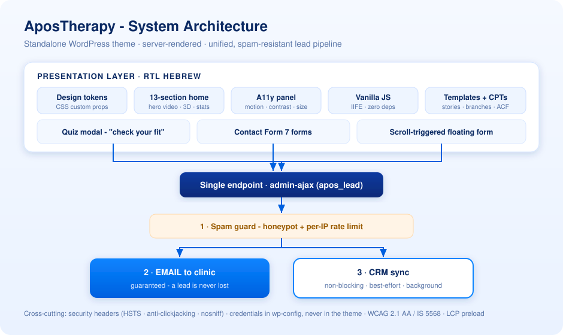

# 🩺 AposTherapy - Website Redesign & Build · Project Showcase

A premium, bilingual-ready **RTL Hebrew** website for a medical / physiotherapy clinic that I designed and built end-to-end - a standalone WordPress theme, performance-first, fully accessible, with a unified email-plus-CRM lead engine.

> 🔒 **This is a public showcase, not the source.** The theme's code and any real data are kept private. Everything here is a high-level overview; all credentials, CRM keys and internal data were removed and are supplied through `wp-config.php`.

> 🚀 **Live since July 2026.** The redesign is now the production site. Early post-launch signal from Google Search Console: **+15% daily organic clicks** with flat impressions - i.e. a measurable **click-through-rate uplift** from the new titles, speed and UX.

---

## 📋 Overview / סקירה

🇬🇧 A ground-up redesign and rebuild of a physiotherapy clinic's website, delivered as an **independent WordPress theme** that installs *alongside* the existing site - reusing the same custom post types, ACF fields, menus and form wiring, so it could be previewed live and switched on with **zero data migration and zero downtime**. The guiding idea is **a design system, not one-off pages**: a single design-token layer feeds every section, so the look stays consistent and each new page inherits it automatically. It is **server-rendered** for SEO, **fully accessible** to WCAG 2.1 AA / Israeli Standard 5568, tuned for **fast Core Web Vitals**, and built around one job - turning visitors into qualified leads through a guided **"check your fit" quiz** and a **unified lead engine** that never loses a submission.

🇮🇱 עיצוב ובנייה מחדש של אתר מרפאת פיזיותרפיה, כערכת עיצוב **עצמאית ל-WordPress** שמותקנת לצד האתר הקיים - שומרת על אותם סוגי תוכן, שדות ACF, תפריטים וחיבורי טפסים, כך שאפשר לצפות בה באוויר ולהפעיל אותה בלי הגירת נתונים ובלי זמן השבתה. הרעיון המנחה - **מערכת עיצוב, לא עמודים בודדים**: שכבת design-tokens אחת מזינה כל סקשן, וכל עמוד חדש יורש את השפה אוטומטית. האתר **מרונדר בשרת** לטובת SEO, **נגיש מלא** לפי ת"י 5568 / WCAG 2.1 AA, מכוון ל**ביצועים גבוהים**, ובנוי סביב מטרה אחת - להפוך מבקרים ללידים דרך **שאלון התאמה** מודרך ו**מנוע לידים אחוד** שלא מאבד אף פנייה.

---

## 🏗️ Architecture

A classic **server-rendered WordPress theme** (no page builder, no client framework) on top of the clinic's existing data. Every lead path - the quiz modal, every Contact Form 7 form, and a scroll-triggered floating form - funnels into **one endpoint** (`admin-ajax`), which first runs a spam guard (hidden honeypot + per-IP rate limit), then **always emails the clinic**, and only then pushes to the CRM in the background. The principle is **capture first, sync second**: the email is guaranteed so a lead is never lost, while the CRM sync is best-effort and its failures never touch the visitor. Credentials live in `wp-config.php` constants (never in the theme) and are overridable through a single WordPress filter.

---

## 🧩 What's inside

| Area | Highlights |
| ---- | ---------- |
| **Design system** | A **design-token** CSS layer (custom properties for a royal-blue scale + semantic colors) that every section reads from · fluid typography with `clamp()` · Hebrew-first pairing (**Heebo** body + **Secular One** display, `font-synthesis:none`) · glassmorphism & `backdrop-filter` · a tasteful **3D tilt** on hover · one shared component language so the whole site feels cohesive |
| **Homepage** | A **13-section** narrative landing page: a cinematic hero with an **autoplaying muted video**, a health-fund trust bar, "how it works", a pain-area navigator, the gait-lab feature, awards, an **animated 3D stats band**, patient stories, the treatment-path process, a conditions grid, social proof, hand-picked articles, and a closing call-to-action |
| **Conversion / quiz** | A multi-step **"check your fit" modal** (בדקו התאמתכם) - guided questions (pain area, duration, age group, health fund) that turn an anonymous visitor into a **qualified, contextual lead** · sticky-header and inline CTAs throughout · a **scroll-triggered floating lead form** with a marketing-consent checkbox |
| **Lead engine** | **One pipeline** for the quiz *and* every contact form → `admin-ajax` → **guaranteed email** to the clinic + **non-blocking CRM sync** · hidden **honeypot** + **per-IP rate limit** block bots · consent-first (an unchecked marketing-consent checkbox on every form) · fully **filterable** config · a hardened **legacy endpoint** kept alive for the cache-refresh window so no lead is dropped during a deploy |
| **Accessibility** (WCAG 2.1 AA / ת"י 5568) | A visitor-facing **accessibility panel** - **reduce motion**, **high contrast** and **text-size** controls, each **persisted per device** · skip-to-content link · semantic landmarks · full **keyboard navigation** for the mega-menu · every animation gated behind `prefers-reduced-motion` · correctly-sized images (no layout shift) and descriptive alt text |
| **Performance** | **LCP hero-poster preload** · DNS-prefetch · dead-CSS trimming · poster-first, metadata-only video · zero cumulative layout shift · vanilla JS driven by **IntersectionObserver** so nothing runs off-screen · production Lighthouse **SEO 100 · A11y 97 · Best Practices 92 · Performance 89 mobile / ~97 desktop** |
| **Motion & media** | An **ambient hero video** with **robust autoplay recovery** (retries on first gesture + IntersectionObserver + `visibilitychange` + forced-muted) so it plays even under **iOS Low Power Mode / data-saver** · scroll-reveal animations · a soft glow pulse on primary CTAs - all disabled instantly when reduce-motion is on |
| **Security** | Response **security headers** baked into the theme - **HSTS**, `X-Content-Type-Options`, `X-Frame-Options`, `Referrer-Policy`, `Permissions-Policy` · **no secrets in the theme** - every credential is read from `wp-config.php` |
| **Content & templates** | Preserves the site's **custom post types** (patient stories, clinic branches), **ACF** fields and menus · bespoke templates for the about page (with practitioner bios), condition pages (knee / back / hip …), the gait lab, an at-home program, contact, research and sitemap |
| **Zero-risk rollout** | A token-based **live-preview** mechanism renders the new theme on the **production domain** for the client to approve - cookie-persisted across pages, cache-busting - **without activating it** or affecting real visitors · every release bumps a single version constant that **also busts the asset cache** |

---

## 🛠️ Tech & Engineering

- **Platform:** WordPress with hand-built **classic PHP templates** - server-rendered (SEO-friendly, zero hydration cost), PHP 7.4+, no page builder, no lock-in.
- **Styling:** a hand-authored **design-token CSS system** (custom properties → semantic colors, spacing, fluid type) - full **RTL** control, `clamp()` typography, **no utility-class bloat**; Hebrew-first fonts (Heebo + Secular One).
- **JavaScript:** **vanilla ES6** in isolated **IIFE modules** (quiz modal, accessibility panel, floating lead form, hero-video autoplay recovery, smooth anchor-scroll, scroll-to-top, keyboard mega-menu) - **zero dependencies, zero build step**, progressive enhancement, `prefers-reduced-motion` respected everywhere.
- **Lead pipeline:** a single `admin-ajax` handler - **email-first, CRM-second**; hidden honeypot + **transient-based per-IP rate limit**; provider config via `wp-config.php` constants and a WordPress filter, so keys are never in source.
- **Integrations:** **Contact Form 7**, **ACF**, and the clinic's **CRM** - preserved from the original stack and wired through hidden-field injection + UTM passthrough.
- **Accessibility engineering:** `localStorage`-persisted preference toggles, a reduce-motion cascade, ARIA on interactive controls, and no-CLS image sizing.
- **Performance engineering:** LCP preload, selective asset dequeue, DNS-prefetch, and a poster-first video strategy.
- **Delivery discipline:** single-source **version + cache-buster**, a **PHP lint pass across every template** before packaging, and a client hand-off pack - a fully illustrated **install guide**, a **performance roadmap** and an **SEO / CRO action plan**.

---

## 🔍 SEO · GEO · AIO Engineering

Search visibility is engineered into the theme itself, not bolted on with a plugin - and extended to the new generation of **AI answer engines**.

| Layer | What was built |
| ----- | -------------- |
| **Structured data** | Hand-authored **schema.org JSON-LD**: `MedicalClinic` + `LocalBusiness` (name, phone, branch addresses, service areas), `Organization`, `Physician`, `WebSite` (with `SearchAction`), `BreadcrumbList`, `MedicalWebPage` - plus an **auto-generated `FAQPage`** that reads the on-page accordion at render time, so every current *and future* FAQ feeds Google rich results with zero maintenance |
| **Meta & language** | Per-page **titles + meta descriptions**, self-referential **canonical**, **hreflang** (`he` + `x-default`), full **Open Graph** + Twitter `summary_large_image`, and enhanced robots directives (`max-image-preview:large`, `max-snippet:-1`) live on every page |
| **GEO / AIO** (AI search) | A structured **`llms.txt`** site-map for LLMs (service summary, proof points, every key page by category) + an explicit **AI-crawler allow-list** in `robots.txt` (GPTBot, ClaudeBot, PerplexityBot, Google-Extended, Applebot-Extended, CCBot …) so the clinic can surface in **ChatGPT / Gemini / Perplexity** and Google AI Overviews |
| **Indexing & discovery** | XML sitemaps (index + page + patients), verified in **Google Search Console** *and* **Bing Webmaster Tools**; a live per-page SEO audit confirmed unique, keyword-focused metadata across the site |
| **Email authentication** | Full anti-spoofing trio configured at the DNS zone: **SPF + DKIM + DMARC** |

---

## 📈 Results

| Metric | Result |
| ------ | ------ |
| **Lighthouse - SEO** | **100 / 100** |
| **Lighthouse - Accessibility** | **97 / 100** |
| **Lighthouse - Best Practices** | **92 / 100** |
| **Lighthouse - Performance** | **89** mobile · ~**97** desktop |
| **Accessibility standard** | Israeli Standard 5568 (WCAG 2.1 AA) |
| **Lead capture** | Guaranteed email + automatic CRM sync, spam-guarded |
| **Migration / downtime** | **Zero** - shipped alongside the existing site |
| **Launch** | **Live since July 2026** - now the production site |
| **Organic search (quarter)** | **~28.5K clicks · 1.29M impressions** (Google Search Console) |
| **Post-launch signal** | **+15% daily organic clicks**, flat impressions → CTR uplift |
| **Indexing** | **368 pages indexed**; sitemaps healthy on Google + Bing |
| **AI search readiness** | `llms.txt` + AI-crawler allow-list + rich structured data |
| **Email auth** | SPF + DKIM + **DMARC** (full anti-spoofing) |

---

## 🖼️ Screenshots

> More screens can be added here (quiz modal · accessibility panel · condition pages · lead forms).

---

## 🔐 Privacy & scope

This repository intentionally contains **no source code, no credentials, and no real data**. It exists to document the project and my role in designing, building and delivering it end-to-end. Implementation details are available on request in a suitable setting.

---

Designed, developed and delivered by <a href="https://github.com/galasulin">@galasulin</a> · Web &amp; IT.

