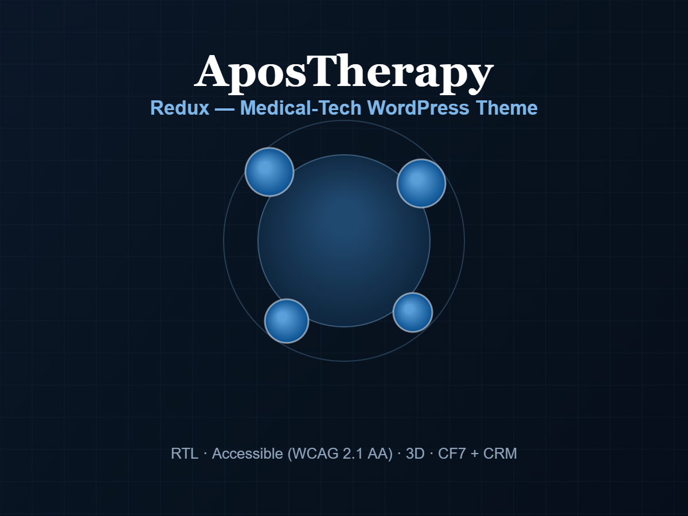

<div align="center">

# AposTherapy - Website Redesign & Build

### Premium WordPress experience for a medical / physiotherapy clinic
Full redesign · RTL Hebrew · WCAG 2.1 AA accessibility · performance-first · CRM-integrated lead capture

[](https://www.apostherapy.co.il)
<br>


</div>

> **This is a case study, not a code repository.**
> It presents a real client project - the goals, the work, and the results.
> The source code is **proprietary and intentionally not published here.**

---

## The brief

Rebuild the AposTherapy clinic website into a **premium, trust-building medical experience** in Hebrew (RTL)
that loads fast, is fully accessible under Israeli Standard 5568 / WCAG 2.1 AA, and reliably converts
visitors into qualified leads - all while preserving the clinic's existing content, forms and CRM wiring
so it could go live with zero data migration and zero downtime.

<div align="center">

</div>

## Results

| Metric | Result |
|---|---|
| **Lighthouse - SEO** | **100 / 100** |
| **Lighthouse - Accessibility** | **97 / 100** |
| **Lighthouse - Best Practices** | **92 / 100** |
| **Lighthouse - Performance** | **89** mobile · ~**97** desktop |
| **Accessibility standard** | Israeli Standard 5568 (WCAG 2.1 AA) |
| **Lead capture** | Guaranteed email + automatic CRM sync |
| **Migration / downtime** | Zero - shipped alongside the existing site |

## What was delivered

- **Complete visual redesign** - a modern, premium medical brand language with glassmorphism, subtle 3D
  depth, and an autoplaying hero video (with robust autoplay recovery for iOS Low Power Mode).
- **Full RTL Hebrew experience** - typography, layout and components designed Hebrew-first.
- **Accessibility built in, not bolted on** - a visitor-facing accessibility panel with reduce-motion,
  high-contrast and text-size controls, all persisted per device; full keyboard navigation; skip links;
  correct image sizing (no layout shift).
- **A unified lead engine** - the "check your fit" quiz and every contact form flow through one pipeline
  that *always* emails the clinic and *also* syncs to the CRM in the background, so no lead is ever lost.
- **Performance & SEO pass** - image optimization, LCP preloading, asset trimming, clean semantic markup.
- **Security hardening** - modern security headers (HSTS, anti-clickjacking, MIME-sniffing protection,
  referrer & permissions policies).
- **Zero-risk rollout** - a private preview mechanism let the client review the new design on the live
  domain before switching it on, with no impact on the running site.

## How the lead engine works

Every submission - quiz or contact form - runs through a single, spam-resistant pipeline:

```
   Quiz  ─┐
          ├─►  one endpoint  ─►  1. spam guard (honeypot + rate limit)
   Forms ─┘                      2. EMAIL to clinic   (guaranteed - never lost)
                                 3. CRM sync          (automatic, in the background)
```

The guiding principle: **capture first, sync second.** The clinic always gets the lead by email even if
the CRM is down or misconfigured; the CRM sync happens quietly in the background and never slows the
visitor or risks the submission.

## Tech & approach

- **WordPress** with hand-built classic PHP templates - no bloated page builder
- **Zero JavaScript frameworks** - lightweight, hand-written, progressively enhanced
- **Design-token CSS** - full control of RTL, fluid typography, and theming
- **Hebrew-first typography** - Heebo (body) + Secular One (display)
- Delivered **end-to-end**: design, development, accessibility, performance, SEO, and CRM integration

## תקציר בעברית

עיצוב ובנייה מחדש של אתר אפוסתרפיה: חוויה פרימיום בעברית (RTL), נגישות מלאה לפי ת"י 5568 / WCAG 2.1 AA,
ביצועים גבוהים (Lighthouse SEO 100, נגישות 97), ומנוע לידים אחוד שלוכד גם את שאלון ההתאמה וגם את טפסי
הקשר - שולח מייל מובטח ומסנכרן ל-CRM ברקע, בלי שאף פנייה תאבד. הפרויקט הושק לצד האתר הקיים, בלי סיכון ובלי
זמן השבתה. העמוד הזה הוא תצוגת פרויקט בלבד - **הקוד עצמו פרטי ואינו מפורסם.**

---

<div align="center">
<sub>© Gal Asulin · Web &amp; IT. Designed, developed and delivered end-to-end.<br>
Presentation only. Source code is proprietary and not included in this repository.</sub>
</div>
